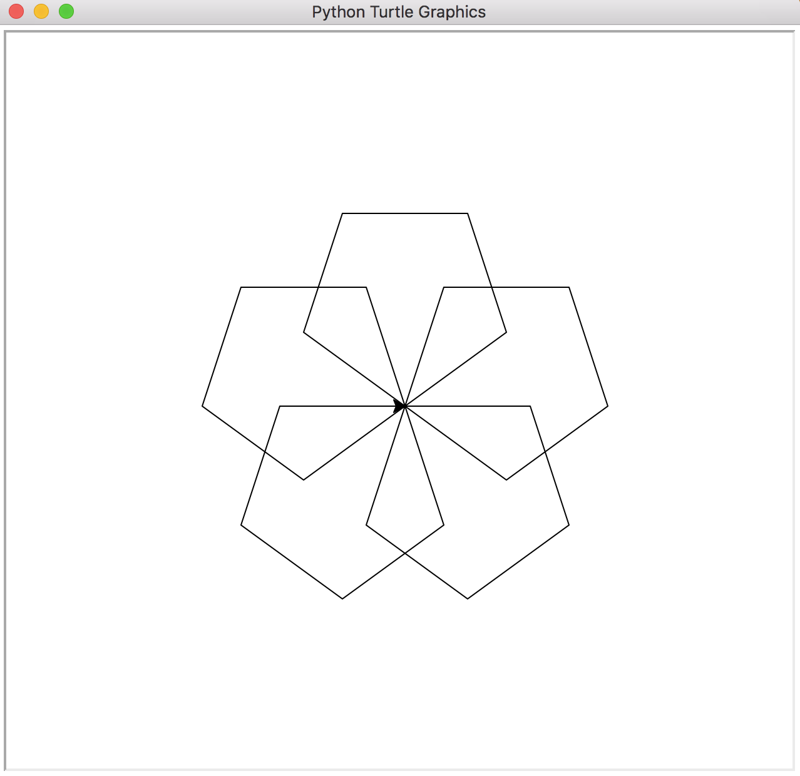

# Turtle-Graphics-LOGO-Lang-Compiler

Python has this module called [turtle](https://docs.python.org/2/library/turtle.html).
[LOGO](https://www.wikiwand.com/en/Logo_(programming_language)) is a programming language, to draw with turtle graphics.
This repo implements a [compiler](logo/compiler) and [runtime](logo/runtime) for LOGO language using python and its turtle module.

The syntax may not be completely compatible with the original, as I have added certain features while removed certain original features. This is just a fun project for the Turtle Graphics with [REPL](logo/runtime/repl.py) for the UI.

# Syntax
```
# This is a comment, comments should be in fresh line only
# RT is for right turn, 90 is the angle to turn right
RT 90
# FD is for forward, 100 is length to move forward
FD 100

# The REPEAT construct, is for looping
# The number 4, instructs to loop 4 times
REPEAT 4 [
  RT 90
  FD 100
]

# The TO construct, is to define procedures
TO SQUARE [
  REPEAT 4 [
    RT 90
    FD 100
  ]
]

# In the above example, the proceduce defines 
# how to draw a square. But this useless if
# we want to draw a square of some size

# :FOO is a variable, while 100 is a literal
# There are no data types, expect FLOAT or INT

# To draw a square of some size, say :SIDE
TO SQUARE :SIDE [
  REPEAT 4 [
    RT 90
    FD :SIDE
  ]
]

# Inside the REPEAT construct, at each loop iteration
# The is an inbuild variable called :REPCOUNT that
# will be available and automatically updated each iteration.

REPEAT 6 [
  RT :REPCOUNT * 60
]

# The above code is same as 
RT 1 * 60
RT 2 * 60
RT 3 * 60
RT 4 * 60
RT 5 * 60
RT 6 * 60

# For simplicity, there are is no IF-THEN-ELSE construct
# There are neither variable assignments, nor booleans

# But, there are expressions which can be placed
# as arguments in place of literals and variables
# Expressions can contain variables and literals, 
# which will be dynamically evaluated.

# Example for expressions, in argument
FD SQRT(100 * :SIDE + :SIDE)

# note the variable such as :SIDE here should be used
# only inside as Procedure, It is best to enclose expressions
# in brackets and also, enclose brackets to be clear about
# the order of evaluation

```
# LOGO instruction
| Instruction | No. of Arguments | Description |
|--- |--- |--- |
| RT | 1  | Right Turn, argument is angle of turn. |
| LT | 1  | Left Turn, argument is angle of turn. |
| FD | 1  | Move Forward, argument is length to move. |
| BK | 1  | Move Backward, argument is length to move. |
| PU | 0  | Pen up, no arguments. |
| PD | 0  | Pen down, no arguments. |
| CLEAR | 0 | Clear the screen. |
| HOME | 0 | Move to Home(starting) position.|
| RESET | 0 | Reset everything, to initial. |
| SPEED | 1 | Set the speed of the turtle, 0=Fastest, 1 to 10 = progressively faster.|

# Arithmetic Operators and Mathematical Functions
All the basic arithmetic operators such as `+, -, *, /, %, ^` are supported. `%` is modulus and `^` exponentiation. Some inbuild math function are `SQRT(a)`, `MIN(a, b)`, `MAX(a, b)`, `RAND(a, b)`.

# The REPL

Steps to use this repo

* Download or clone this repo
* Install `cmd2` python module with `python -m pip install cmd2`.
* To run the program, do `cd /path/to/root/of/this/project` and type `python logo/runtime/repl.py`

The prompt pops up `logo[{count}]:>`


There is a sample code in [samples/polygon.logo](samples/polygon.logo).
* To load and compile this code, in the REPL execute `load samples/polygon.logo`
* Type `ast` to see the compiled code
* Type `Hexagon 100`, this draws hexagon of size 100
* Type `RESET` or `CLEAR` or `HOME`, to recenter, clear or move turtle to home position
* Type `REPEAT 5 [ FD 100; RT (360 / 5) ]` to draw a pentagon
* Type up arrow to see prev commands.
* Type `SPEED 0` to set speed to fastest, or 1 to 10 to be progressively faster.
* Type `exit` or `quit` to quit.

Don't forget to try `FLOWER :PETALS :SIZE` to draw a flower, actually you seed to substitute values, for examples `FLOWER 30 100` or `FLOWER 90 100`.

And note, the language is case insensitive, but capitals are prefered. So, `FLOWER` or `Flower` or `flower` are same. But the `load`, `hepl`, `quit` and `exit` should be in lower case. They are REPL command, and not executed by the runtime.

For some adventure, try modifying the code in the sample file polygon.logo and reload it. To reload, just type `load samples/polygon.logo`, same as loading.

# Gallery

Try `flower 30 100`


Try `repeat 5 [ polygon 100 5; rt 72 ]`




Happy Turtling ...

# Future Work

* Add support for IF-THEN-ELSE construct
* Add Boolean data type
* Add Boolean expressions and relational expressions
* Add Assignments of expressions to variables
* Add Recursion of Procedures

